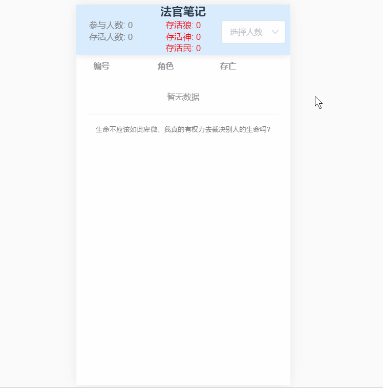

# 法官笔记

狼人杀法官记录器，用于记录全场玩家的阵营和存亡，附带统计功能

> 用于减轻法官的记忆负担和提高统计效率

## 在线使用

* 访问以下链接可在线使用
* http://jiankesword.gitee.io/judge-notes-online/

## 图片预览

## 开发

### 用到的框架和库

* 使用 Vue + vuex + element-ui

### 如何运行工程

* 需要安装 nodeJs
* 将项目 clone 至本地，运行 npm  install 下载依赖
* 下载完依赖后 npm run serve 即可运行本项目
* 构建: npm run build

## 需求 & bug

* 欢迎 issue 或者留言

## 支持作者

* 鼓励和支持作者可以加速这个项目的更新
* 想支持作者可以购买 **火鸡面** 淘口令： ￥ygZncagVzXB￥
